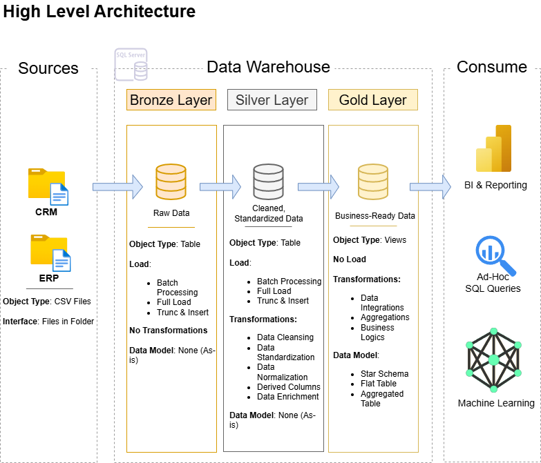
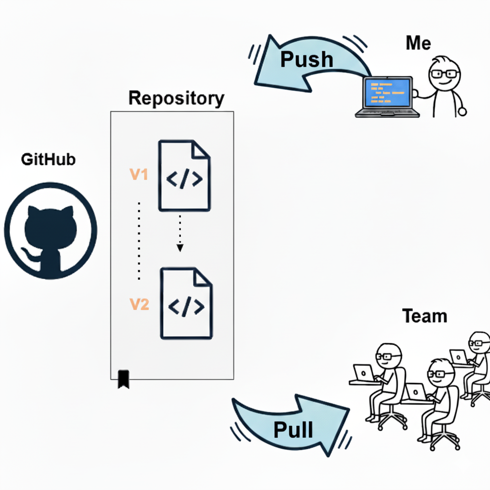

# Data Warehouse and Analytics Project

This project demonstrates a comprehensive Data Warehousing and Analytics solution, from building a Data Warehouse to generating actionable Insights. Designed as a Portfolio Project, it highlights Industry Best Practices in Data Engineering and Analytics.

## Data Architecture

The Data Architecture for this project follows Medallion Architecture **Bronze**, **Silver** and **Gold** Layers:

1. **Bronze Layer**: Stores raw data as it is from the source Systems. Data is ingested from CSV Files into SQL Server Database.
2. **Silver Layer**: This layer includes Data Cleansing, Standardization, and Normalization processes to prepare data for analysis.
3. **Gold Layer**: Houses Business-Ready data modeled into a Star Schema required for reporting ana analytics.

## Project Overview
1. **Data Architecture**: Designing a Modern Data Warehouse Using Medallion Architecture **Bronze**, **Silver**, and **Gold** layers.
2. **ETL Pipelines**: Extracting, transforming, and loading data from source systems into the warehouse.
3. **Data Modeling**: Developing fact and dimension tables optimized for analytical queries.
4. **Analytics & Reporting**: Creating SQL-based reports and dashboards for actionable insights.

## Tools Used
- SQL Server Express
- SQL Server Management Studio (SSMS)
- Git Repository
- DrawIO

Here is a nice illustration that I drew on DrawIO then edited Me and Team icons on Gemini that shows Git in action


## Project Requirements
#### Objective
Develop a modern data warehouse using SQL Server to consolidate sales data, enabling analytical reporting and informed decision-making.

#### Specifications
- **Data Sources**: Import data from two source systems (ERP and CRM) provided as CSV files.
- **Data Quality**: Cleanse and resolve data quality issues prior to analysis.
- **Integration**: Combine both sources into a single, user-friendly data model designed for analytical queries.
- **Scope**: Focus on the latest dataset only; historization of data is not required.
- **Documentation**: Provide clear documentation of the data model to support both business stakeholders and analytics teams.

---

### BI: Analytics & Reporting (Data Analysis)

#### Objective
Develop SQL-based analytics to deliver detailed insights into:
- **Customer Behavior**
- **Product Performance**
- **Sales Trends**

These insights empower stakeholders with key business metrics, enabling strategic decision-making.  

For more details, refer to [docs/requirements.md](docs/requirements.md).

## 📂 Repository Structure
```
data-warehouse-project/
│
├── datasets/                           # Raw datasets used for the project (ERP and CRM data)
│
├── docs/                               # Project documentation and architecture details
│   ├── etl.drawio                      # Draw.io file shows all different techniquies and methods of ETL
│   ├── data_architecture.drawio        # Draw.io file shows the project's architecture
│   ├── data_catalog.md                 # Catalog of datasets, including field descriptions and metadata
│   ├── data_flow.drawio                # Draw.io file for the data flow diagram
│   ├── data_models.drawio              # Draw.io file for data models (star schema)
│   ├── naming-conventions.md           # Consistent naming guidelines for tables, columns, and files
│
├── scripts/                            # SQL scripts for ETL and transformations
│   ├── bronze/                         # Scripts for extracting and loading raw data
│   ├── silver/                         # Scripts for cleaning and transforming data
│   ├── gold/                           # Scripts for creating analytical models
│
├── tests/                              # Test scripts and quality files
│
├── README.md                           # Project overview and instructions
├── LICENSE                             # License information for the repository
├── .gitignore                          # Files and directories to be ignored by Git
```

## License
This project is licensed under the [MIT License](LICENSE). You are free to use, modify, and share this project with proper attribution.